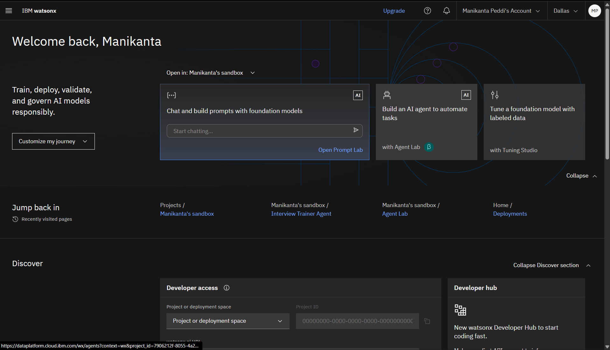

# Build an Interview Trainer Agent on IBM Cloud (Step-by-Step)

This guide walks you through creating and deploying an **Interview Training Agent** on IBM Cloud using watsonx.ai Agent Lab - no coding required.

---

## Prerequisites
- IBM Cloud account (Lite plan is fine) → [Sign up](https://cloud.ibm.com/registration)
- A modern web browser (Chrome, Edge, Firefox)

---

## Step 1 - Log in to IBM Cloud
1. Go to [https://cloud.ibm.com](https://cloud.ibm.com)  
2. Click **Log in** (top right) and enter your credentials.

## Step 2 - Open Watsonx Agent Lab
1. In the **Navigation Menu** (top-left ☰), click **Watsonx** or search for “watsonx”.
2. Click **Watsonx.ai**.
3. Scroll to find the **Build an AI agent to automate tasks** tile.
4. Click the tile to open **Agent Lab**.

## Step 3 - Create a Project
1. If prompted, click **Create project** (or **Create sandbox project**).
2. Enter a name like: `InterviewTrainerProject`.
3. Select the **Lite** plan (free tier) and click **Create**.

## Step 4 - Create a New Agent
1. Inside your project, click **New asset → Build an AI agent to automate tasks**.
2. **Name:** `InterviewTrainerAgent`
3. **Description:** “Conducts mock interviews, evaluates answers, and gives feedback.”
4. (Optional) Add example prompts for testing.
5. Click **Create**.

## Step 5 - Select Model
1. In the Agent editor, click **Change model** or **View all foundation models**.
2. Choose a Lite-eligible model (e.g., `mistral-large` or `granite-13b-chat` if available).
3. Click **Select model**.

## Step 6 - Add Instructions
Paste the following into the **Instructions** section:

> You are an Interview Training Agent with 20+ years of experience as a mentor, hiring manager, and teacher.  
> Conduct realistic mock interviews, ask one question at a time, wait for responses, evaluate answers on correctness, clarity, depth, problem-solving, and communication (1–5 each), then give strengths, improvements, and one suggested resource/exercise.  
> Adapt difficulty based on performance. Use STAR method for behavioral questions. Stay professional, encouraging, and constructive.

## Step 7 - (Optional) Add Tools / Knowledge
1. In the **Tools** section, click **Add a tool**.
2. Choose **Document search** or **Web search** if available.
3. Upload any reference Q&A dataset (JSON, TXT, PDF).

## Step 8 - Save the Agent
1. Click **Save** (top right).
2. Give it a version name (e.g., `v1.0`) and click **Save as agent**.

## Step 9 - Associate Watsonx.ai Runtime
1. If prompted, click **Associate service**.
2. Select **watsonx.ai Runtime** (Lite plan) → click **Create**.
3. Wait for the service to be provisioned.

## Step 10 - Create a Deployment Space
1. In the left menu, click **Deployment spaces**.
2. Click **New deployment space**.
3. Name: `InterviewTrainerSpace`
4. Select your **watsonx.ai Runtime** instance.
5. Click **Create** and wait until ready.

## Step 11 - Deploy the Agent
1. Open your deployment space.
2. Click **Add asset → Promote from project**.
3. Select your `InterviewTrainerAgent`.
4. Click **Deploy** → choose **Online** deployment.
5. Name it `InterviewTrainerDeploy` → click **Deploy**.

## Step 12 - Test the Agent
1. Once deployment is ready, click **Preview**.
2. Type a message: “Start a mock interview” and send.
3. Answer the question, receive feedback, and continue.

  

---

## Done!
Your Interview Trainer Agent is now live in IBM Cloud.  
You can share the **Preview** link or connect to the API from any app.

## Next Steps (Optional)
- Add more questions/answers to improve variety.
- Enable voice features with IBM Speech to Text & Text to Speech.
- Integrate into a web or mobile app via the deployment API.

---

## 👋 About the Creator

Built with way too much coffee ☕, late-night brainstorming 🌙, and a lot of curiosity 💡 by **Manikanta Peddi**.  
Proudly crafted on the free tier (because who doesn’t love free stuff 😄),  
and tested with both *brave coding optimism* and *mild panic* before deadlines.  

If this agent helps you crack an interview or makes you smile,  
just know it was **made with love ❤️, a dash of humor 😂, and a sprinkle of tech magic ✨**.

---

> *“Interviews are just conversations… where someone asks you tricky questions and stares at your soul.  
> Let’s make them less scary - one mock session at a time!”* 😎
